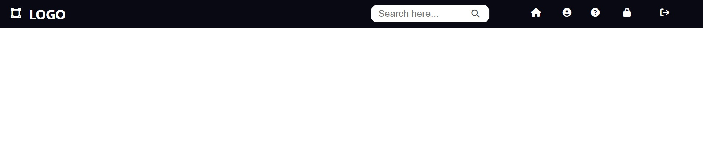
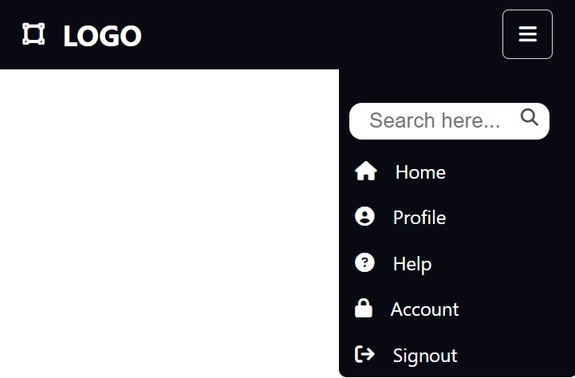

# simple-header-2

## Short description of project:
Responsive and simple header for website

## Demo

## Prerequisites
Before you begin, ensure you have met the following requirements:
- Git must be installed on your operating system.

## Installing
To install, follow these steps:

## Linux and macOS:
sudo git clone https://github.com/BatigAndriy/simple-header-2

## Windows:
git clone clone https://github.com/BatigAndriy/simple-header-2

## License
This project is free to use and does not contain any license.
